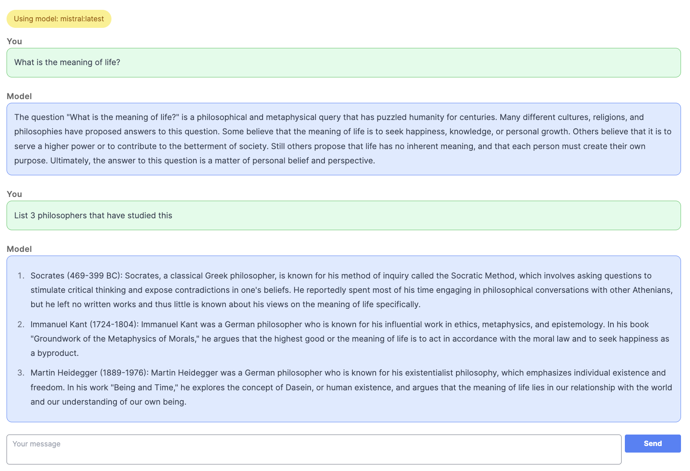

<!-- START doctoc generated TOC please keep comment here to allow auto update -->
<!-- DON'T EDIT THIS SECTION, INSTEAD RE-RUN doctoc TO UPDATE -->
**Table of Contents**  *generated with [DocToc](https://github.com/thlorenz/doctoc)*

- [Ollama Chat Rails](#ollama-chat-rails)
  - [Differences in this project from tutorial](#differences-in-this-project-from-tutorial)
    - [JavaScript and CSS Handling](#javascript-and-css-handling)
    - [Encoding](#encoding)
    - [Context](#context)
    - [Separate Sessions](#separate-sessions)
    - [Introduce Ollama::Client for Communication with Model](#introduce-ollamaclient-for-communication-with-model)
    - [Configurable model and API endpoint](#configurable-model-and-api-endpoint)
    - [Extract Turbo Stream Response Partials](#extract-turbo-stream-response-partials)
    - [Display Conversation](#display-conversation)
    - [Markdown Styling](#markdown-styling)
    - [Auto Scroll](#auto-scroll)
    - [Copy Model Response to Clipboard](#copy-model-response-to-clipboard)
  - [Project Setup](#project-setup)
  - [Future Features](#future-features)
    - [WIP: Copy model response to clipboard](#wip-copy-model-response-to-clipboard)
    - [Temperature and other options](#temperature-and-other-options)
    - [Deal with unescaped html warning from marked/highlight](#deal-with-unescaped-html-warning-from-markedhighlight)
  - [Deployment](#deployment)

<!-- END doctoc generated TOC please keep comment here to allow auto update -->

# Ollama Chat Rails

The starting point for this Rails project was from the [Streaming LLM Responses  ▶️](https://youtu.be/hSxmEZjCPP8?si=ps__eK0MbuSDFPXw) tutorial for building a streaming AI chatbot with Rails and Ollama. Then many more features were added as well as some refactoring for maintainability.

It looks something like this:



This project uses Hotwire for SPA like interactivity features including:

* [Turbo Streams](https://github.com/hotwired/turbo-rails?tab=readme-ov-file#come-alive-with-turbo-streams) over websockets (via ActionCable) to stream the response from the LLM to the UI.
* Turbo Stream as regular HTTP response to clear our the chat form without requiring a full page refresh
* [Stimulus](https://github.com/hotwired/stimulus) for some lightweight JS to augment the model responses by converting to markdown and syntax highlighting code blocks (together with the marked and highlight.js libraries).

Example:

```ruby
# chat_id is randomly assigned earlier to ensure each user gets their own stream
# and doesn't receive messages intended for a different user.

# [chat_id, "welcome"] - array argument passed to broadcast_append_to, used to construct the unique signed stream name

# This will find a DOM element with id of `some_id` and append "some content" to it, for any client
# that subscribed to this stream with: <%= turbo_stream_from @chat_id, "welcome" %>
Turbo::StreamsChannel.broadcast_append_to [chat_id, "welcome"], target: "some_id", html: "some content"
```

## Differences in this project from tutorial

### JavaScript and CSS Handling

Original tutorial uses [esbuild](https://github.com/rails/jsbundling-rails) for JavaScript and [Bootstrap](https://getbootstrap.com/) for styles. This project uses [importmaps](https://github.com/rails/importmap-rails) for JavaScript and [TailwindCSS](https://tailwindcss.com/docs/installation) for styles.

Since `ChatJob` generates an html string for the message chunks, need to configure this as a content source for Tailwind, otherwise, the referenced Tailwind classes will not get included in the Tailwind build/generated css:

```javascript
// config/tailwind.config.js
module.exports = {
  content: [
    ...
    './app/jobs/**/*.rb',
  ],
  ...
}
```

The original tutorial uses `yarn add` to add the [marked](https://github.com/markedjs/marked) and [highlight.js](https://github.com/markedjs/marked) JavaScript dependencies. But this project uses importmaps so the process to add JS libs is different:

```bash
bin/importmap pin marked
# Pinning "marked" to vendor/javascript/marked.js via download from https://ga.jspm.io/npm:marked@12.0.1/lib/marked.esm.js

bin/importmap pin highlight.js
#Pinning "highlight.js" to vendor/javascript/highlight.js.js via download from https://ga.jspm.io/npm:highlight.js@11.9.0/es/index.js
```

The above commands add new `pin` entries to `config/importmap.rb`.

But actually for highlight, the above didn't work, instead I had to write the pin as:

```ruby
# config/importmap.rb

# other pins...

# Ref: https://stackoverflow.com/questions/77539248/adding-highlightjs-to-rails-7-1-with-importmaps
pin "highlight.js", to: "https://cdnjs.cloudflare.com/ajax/libs/highlight.js/11.9.0/es/highlight.min.js"
```

Also need CSS for highlight.js theme, added to `app/views/layouts/application.html.erb`:

```erb
<head>
  <link rel="stylesheet" href="https://cdn.jsdelivr.net/gh/highlightjs/cdn-release@11.9.0/build/styles/github-dark.min.css">
</head>
```

### Encoding

Was getting encoding errors from some response chunks from model, fix by specifying UTF-8 encoding:

```ruby
json = JSON.parse(chunk.force_encoding("UTF-8"))
```

### Context

> The context parameter returned from a previous request to /generate, this can be used to keep a short conversational memory.

An encoding of the conversation used in this response, this can be sent in the next request to keep a conversational memory

The original tutorial does not include context for conversational history. To have the model remember the past conversations you've been having with it, need to save the `context` from the Ollama [REST API](https://github.com/ollama/ollama/blob/main/docs/api.md) response (for eg: in Rails cache), then include this context in the next Ollama REST API request.

For example:

```ruby
# When making a request
cache_key = "context_#{chat_id}"
cached_context = Rails.cache.read(cache_key)

uri = URI("http://localhost:11434/api/generate")
request = Net::HTTP::Post.new(uri, "Content-Type" => "application/json")
request.body = {
  model: "mistral:latest",
  prompt: context(prompt),
  context: cached_context,
  temperature: 1,
  stream: true
}.to_json

# Later when received response with done: true
Net::HTTP.start(uri.hostname, uri.port) do |http|
  http.request(request) do |response|
    response.read_body do |chunk|
      # chunks are json, eg:
      # {"model":"mistral:latest","created_at":"2024-03-18T12:48:19.494759Z","response":" need","done":false}
      # When done is true, we get an empty response, but with `context` populated
      Rails.logger.info("✅ #{chunk.force_encoding('UTF-8')}")
      process_chunk(chunk, rand, chat_id)
    end
  end
end

def process_chunk(chunk, rand, chat_id)
  json = JSON.parse(chunk.force_encoding("UTF-8"))
  done = json["done"]
  if done
    Rails.logger.info("🎉 Done streaming response for chat_id #{chat_id}.")

    # cache context for next inference
    context = json["context"]
    cache_key = "context_#{chat_id}"
    Rails.cache.write(cache_key, context)
    # ...
end
```

### Separate Sessions

With the original tutorial, every connected client subscribes to the same `"welcome"` stream in the welcome index view:

```erb
<%# app/views/welcome/index.html.erb %>
<%= turbo_stream_from "welcome" %>
```

Check dev tools -> Network -> WS -> `/cable` -> Messages -> Filter: `signed_stream_name`

This means if you open multiple browsers (and/or incognito sessions) at `http://localhost:3000`, and type in a question into *any* of them, the model response will be broadcast to *all* browser windows.

To fix this so that each "user", or connected client can have their own unique stream, we need to assign a unique identifier to each chat session. Start in the `WelcomeController` by creating a unique `chat_id` instance variable:

```ruby
# app/controllers/welcome_controller.rb
class WelcomeController < ApplicationController
  def index
    @chat_id = SecureRandom.hex(20)
    Rails.logger.info("🗞️ Generated chat id: #{@chat_id}")
  end
end
```

Then in the index view, pass the `chat_id` to the `turbo_stream_from` helper. This will ensure a unique `signed_stream_name` is generated. Also, pass the `chat_id` as a local variable to the form partial:

```erb
<!-- app/views/welcome/index.html.erb -->
<div class="w-full">
  <h1>Welcome#index</h1>

  <%# Subscribe to welcome channel for real-time updates via ActionCable %>
  <%# Use chat_id so that each connected client will have a unique chat session %>
  <%= turbo_stream_from @chat_id, "welcome" %>

  <%# Here is where we will stream the responses from the llm %>
  <div id="messages"></div>

  <%# The user types in their prompt here %>
  <%= render "form", chat_id: @chat_id %>
</div>
```

Update the form partial so that the chat_id gets submitted in the POST as a hidden field:

```erb
<!-- app/views/welcome/_form.html.erb -->
<%= form_with url: chats_path, html: { id: "chat_form" } do |f| %>
  <%= f.hidden_field :chat_id, value: chat_id %>
  <div>
    <div>
      <%= f.text_area :message, placeholder: "Your message", autofocus: true %>
    </div>
    <div>
      <%= f.submit "Send" %>
    </div>
  </div>
<% end %>
```

Update the `ChatController` that handles this form POST to pass on the `chat_id` to the `ChatJob`, and also to pass `chat_id` back to the form as a local because it renders a turbo stream response to clear out the form (without refreshing the page, hurray for Turbo!):

```ruby
# app/controllers/chats_controller.rb
class ChatsController < ApplicationController
  def create
    # Interaction with LLM can be slow - execute in the background
    ChatJob.perform_later(params[:message], params[:chat_id])

    # In the meantime, clear out the form text area that user just typed
    render turbo_stream: turbo_stream.replace("chat_form", partial: "welcome/form",
                                                           locals: { chat_id: params[:chat_id] })
  end
end
```

Then use `chat_id` in `ChatJob` to distinguish the `context` cache key (as shown earlier in the context section of this document).

Also, use `chat_id` when broadcasting the model response so that it will go to the correct stream. Notice if you pass an array as the first argument to `broadcast_append_to`, it generates a signed stream name from all the array elements:

```ruby
# app/jobs/chat_job.rb
class ChatJob < ApplicationJob
  queue_as :default

  def perform(prompt, chat_id)
    # ...
  end

  # ...

  def broadcast_message(target, message, chat_id)
    # This uses ActionCable to broadcast the html message to the welcome channel.
    # Any view that has subscribed to this channel `turbo_stream_from @chat_id, "welcome"`
    # will receive the message.
    Turbo::StreamsChannel.broadcast_append_to [chat_id, "welcome"], target:, html: message
  end
end
```

### Introduce Ollama::Client for Communication with Model

In the original tutorial, the ChatJob is also responsible for all the stream http request/response with the Ollama REST API.

In this project, that responsibility has been split out to `Ollama::Client` to handle the request, and stream the response back to the client by yielding to a given block:

```ruby
# lib/ollama/client.rb
require "net/http"

module Ollama
  class Client
    def initialize(model = nil)
      @uri = URI(Rails.application.config.chat["chat_api_url"])
      @model = model || Rails.application.config.chat["chat_model"]
    end

    def request(prompt, cached_context, &)
      request = build_request(prompt, cached_context)
      # Pass the block to `send_request` as `&`
      # so that it can be yielded to
      send_request(request, &)
    end

    private

    def build_request(prompt, cached_context)
      request = Net::HTTP::Post.new(@uri, "Content-Type" => "application/json")
      request.body = {
        model: @model,
        prompt: context(prompt),
        context: cached_context,
        temperature: 1,
        stream: true
      }.to_json
      request
    end

    # Since this is a streaming response, yield each `chunk`
    # to the given block.
    def send_request(request)
      Net::HTTP.start(@uri.hostname, @uri.port) do |http|
        http.request(request) do |response|
          response.read_body do |chunk|
            encoded_chunk = chunk.force_encoding("UTF-8")
            Rails.logger.info("✅ #{encoded_chunk}")
            yield encoded_chunk if block_given?
          end
        end
      end
    end

    def context(prompt)
      "[INST]#{prompt}[/INST]"
    end
  end
end
```

The `ChatJob` uses the Ollama client as follows:

```ruby
def perform(prompt, chat_id)
  rand = SecureRandom.hex(10)
  prompt_id = "prompt_#{rand}"
  response_id = "response_#{rand}"
  broadcast_response_container("messages", prompt, prompt_id, response_id, chat_id)

  cached_context = Rails.cache.read(context_cache_key(chat_id))
  client = Ollama::Client.new
  client.request(prompt, cached_context) do |chunk|
    process_chunk(chunk, response_id, chat_id)
  end
end
```

### Configurable model and API endpoint

In the original tutorial, the model `mistral:latest` and API url `http://localhost:11434/api/generate` are hard-coded in the `ChatJob`. In this version, they're set as environment variables, for example in `.env`:

```bash
CHAT_API_URL=http://localhost:11434/api/generate

# See other values at: https://ollama.com/library
CHAT_MODEL=mistral:latest
```

These are read from a new configuration file:

```yml
# config/chat.yml
default: &default
  chat_api_url: <%= ENV.fetch("CHAT_API_URL") { "http://localhost:11434/api/generate" } %>
  chat_model: <%= ENV.fetch("CHAT_MODEL") { "mistral:latest" } %>

development:
  <<: *default

test:
  <<: *default

production:
  chat_api_url: <%= ENV["CHAT_API_URL"] %>
  chat_model: <%= ENV["CHAT_MODEL"] %>
```

This config is loaded in the application:

```ruby
# config/application.rb
module OllamaChat
  class Application < Rails::Application
    # ...

    # Load custom config
    config.chat = config_for(:chat)
  end
end
```

Then it can be used by `Ollama::Client`:

```ruby
# lib/ollama/client.rb
module Ollama
  class Client
    def initialize(model = nil)
      @uri = URI(Rails.application.config.chat["chat_api_url"])
      @model = model || Rails.application.config.chat["chat_model"]
    end

    # ...
  end
end
```

Also update the main index view to display which model is being used:

```erb
<!-- app/views/welcome/index.html.erb -->
<div class="w-full">
  <span class="bg-yellow-200 border-yellow-400 text-yellow-700 px-4 py-2 mb-4 rounded-full inline-block">
    Using model: <%= Rails.application.config.chat["chat_model"] %>
  </span>

  ...
</div>
```

### Extract Turbo Stream Response Partials

In the original tutorial, the response message div is broadcast from the ChatJob, which takes on the responsibility of building the html response as a heredoc string. In this version, that's extracted to a view partial `app/views/chats/_response.html.erb` that accepts a local variable `rand`:

```erb
<div id="<%= rand %>"
     data-controller='markdown-text'
     data-markdown-text-updated-value=''
     class='border border-blue-500 bg-blue-100 text-blue-800 p-2 rounded-xl mb-2'>
</div>
```

And here is the modified ChatJob method that broadcasts the partial, specifying the value for the `rand` local variable:

```ruby
def broadcast_response_container(target, rand, chat_id)
  Turbo::StreamsChannel.broadcast_append_to [chat_id, "welcome"], target:, partial: "chats/response",
                                                                  locals: { rand: }
end
```

The idea is to avoid presentational concerns in the business logic.

### Display Conversation

In the original tutorial, only the model responses are displayed. In this version, it also captures the prompt the user provided, and broadcasts that back to the UI in a different styled div. This way the total display shows a question and answer style conversation.

To also display the question, the response partial now has "You" and "Model" sections as follows:

```erb
<!-- app/views/chats/_response.html.erb -->
<div class="response-container">
  <span class="font-semibold text-lg opacity-60 tracking-wide">You</span>
  <div id="<%= prompt_id %>"
      class='border border-green-500 bg-green-100 text-green-800 p-2 rounded-xl mb-7'>
      <%= prompt %>
  </div>

  <span class="font-semibold text-lg opacity-60 tracking-wide">Model</span>
  <div id="<%= response_id %>"
      data-controller='markdown-text'
      data-markdown-text-updated-value=''
      class='border border-blue-500 bg-blue-100 text-blue-800 p-2 rounded-xl mb-7'>
  </div>
</div>
```

And the `ChatJob` that broadcasts this partial provides all the necessary locals, including original prompt from user:

```ruby
def broadcast_response_container(target, prompt, prompt_id, response_id, chat_id)
  Turbo::StreamsChannel.broadcast_append_to [chat_id, "welcome"], target:, partial: "chats/response",
                                                                  locals: { prompt_id:, prompt:, response_id: }
end
```

### Markdown Styling

The original tutorial uses Bootstrap. Since this project uses TailwindCSS, it requires a different solution for dynamically styling the HTML that gets generated from the marked JavaScript library. The solution is to use the Tailwind [Typography](https://github.com/tailwindlabs/tailwindcss-typography) plugin. Simply add `prose` and desired modifiers to the response HTML element that contains the streaming response from the model, and the plugin will apply styles to make it legible.

For example:

```erb
<!-- app/views/chats/_response.html.erb -->
<div class="response-container">
  <span class="font-semibold text-lg opacity-60 tracking-wide">You</span>
  <div id="<%= prompt_id %>"
      class='prose prose-lg max-w-none border border-green-500 bg-green-100 p-4 rounded-xl mb-7'>
      <p><%= prompt %></p>
  </div>

  <span class="font-semibold text-lg opacity-60 tracking-wide">Model</span>
  <div id="<%= response_id %>"
      data-controller='markdown-text'
      data-markdown-text-updated-value=''
      class='prose prose-lg max-w-none border border-blue-500 bg-blue-100 p-4 rounded-xl mb-7'>
  </div>
</div>
```

It will look something like this:


### Auto Scroll

In the original tutorial, as the conversation grows in length and the model responses keep streaming, it will go outside of the visible viewport, requiring the user to manually scroll.

This project adds a scroll stimulus controller to the messages container (that contains all the prompt and responses as part of the conversation):

```erb
<!-- app/views/welcome/index.html.erb -->
<div class="w-full">
  <span class="bg-yellow-200 border-yellow-400 text-yellow-700 px-4 py-2 mb-4 rounded-full inline-block">
    Using model: <%= Rails.application.config.chat["chat_model"] %>
  </span>

  <%# Subscribe to welcome channel for real-time updates via ActionCable %>
  <%# Use chat_id so that each connected client will have a unique chat session %>
  <%= turbo_stream_from @chat_id, "welcome" %>

  <%# Here is where we will stream the responses from the llm %>
  <%# Eventually this should consist of a sequence of questions and answers %>
  <div id="messages"
    data-controller="scroll"
    data-scroll-delay-value="100"
    class="overflow-y-auto max-h-[80vh]"></div>

  <%# The user types in their prompt here %>
  <%= render "form", chat_id: @chat_id %>
</div>
```

The Stimulus controller registers a MutationObserver that checks if a vertical scroll is needed every time the content of the messages div is modified (which it is from ChatJob broadcasting new content from the streaming LLM response).

```javascript
// app/javascript/controllers/scroll_controller.js
import { Controller } from "@hotwired/stimulus";

export default class extends Controller {
  static values = { delay: Number };

  connect() {
    this.setupObserver();
  }

  /**
   * Scrolls the element to the bottom after a specified delay.
   */
  scrollBottom() {
    setTimeout(() => {
      this.element.scrollTop = this.element.scrollHeight;
    }, this.delayValue || 0);
  }

  /**
   * Checks if scrolling is needed and performs scrolling if necessary.
   * It calculates the difference between the bottom of the scrollable area
   * and the visible area, and if it exceeds a specified threshold, it calls
   * the scrollBottom method to perform scrolling.
   *
   * scrollHeight:
   *  measurement of the height of an element's content, including content not visible on the screen due to overflow
   *
   * scrollTop:
   *  gets or sets the number of pixels that an element's content is scrolled vertically
   *
   * clientHeight:
   *  inner height of an element in pixels, includes padding but excludes borders, margins, and horizontal scrollbars
   */
  scrollIfNeeded() {
    const threshold = 25;
    const bottomDifference = this.element.scrollHeight - this.element.scrollTop - this.element.clientHeight;

    if (Math.abs(bottomDifference) >= threshold) {
      this.scrollBottom();
    }
  }


  /**
   * A method to set up a MutationObserver to watch for changes in the element.
   */
  setupObserver() {
    const observer = new MutationObserver(() => {
      this.scrollIfNeeded();
    });

    observer.observe(this.element, {
      childList: true,
      subtree: true,
    });
  }
}
```

### Copy Model Response to Clipboard

This project adds a "copy to clipboard" feature. A button renders beneath each model response. When clicked, the model response text is copied to the clipboard. A "clipboard" stimulus JS controller is used for this:

```javascript
// app/javascript/controllers/clipboard_controller.js
import { Controller } from "@hotwired/stimulus";

export default class extends Controller {
  static targets = ["source"]

  copy() {
    const text = this.sourceTarget.innerText
    navigator.clipboard.writeText(text)
      .then(() => {
        console.log('Text copied to clipboard');
      })
      .catch((error) => {
        console.error('Failed to copy text to clipboard:', error);
      });
  }
}
```

This controller is hooked up in the response partial, to a "response_wrapper" div that wraps both the response and the copy button. A `data-clipboard-target="source"` is specified on the actual model response div to indicate this is the div that contains the text to be copied:

```erb
<!-- app/views/chats/_response.html.erb -->
<div class="response-container">
  <span class="font-semibold text-lg opacity-60 tracking-wide">You</span>
  <div id="<%= prompt_id %>"
      class='max-w-none border border-green-500 bg-green-100 p-4 rounded-xl mb-7'>
      <p><%= prompt %></p>
  </div>

  <span class="font-semibold text-lg opacity-60 tracking-wide">Model</span>
  <div id="response_wrapper" data-controller="clipboard">
    <div id="<%= response_id %>"
        data-controller='markdown-text'
        data-markdown-text-updated-value=''
        data-clipboard-target="source"
        class='prose prose-lg max-w-none border border-blue-500 bg-blue-100 p-4 rounded-xl mb-7'>
    </div>
    <%# TODO: Style %>
    <div id="response_controls">
      <button data-action="clipboard#copy">
        Copy to clipboard
      </button>
    </div>
  </div>
</div>
```

## Project Setup

Install:
* Ruby version as specified in `.ruby-version` in project root
* [Docker](https://docs.docker.com/get-docker/)
* [Ollama](https://github.com/ollama/ollama)

In one terminal (db unused for now but could be for future)

```bash
docker-compose up
```

In another terminal:

```bash
# Fetch the LLM (Ref: https://ollama.com/library)
ollama pull mistral:latest

# Environment variables
cp .env.template .env

# Install projects dependencies and setup database
bin/setup

# Enable dev caching (required for context)
bin/rails dev:cache

# Start Rails server and TailwindCSS build in watch mode
bin/dev
```

Navigate to `http://localhost:3000`

Type in your message/question in the text area and click Send.

## Future Features

* Allow user to select from list of available models (how to handle if prompt format is different for each?)
* Save chat history
* Ability to start a new chat
* Run the same prompt against 2 or more models at the same time for comparison
* Cancel response? (model could get stuck in a loop...)
* Keep model in memory longer? (first time load is slow), see Ollama docs, default is 5m: `keep_alive` setting in request body
* `/api/generate` final response contains statistics, maybe log/save those somewhere. To calculate how fast the response is generated in tokens per second (token/s), divide `eval_count` / `eval_duration`.

### WIP: Copy model response to clipboard

* clipboard stimulusjs controller?

```javascript
static targets = ["source"]

copy() {
  text = this.sourceTarget.select();
  navigator.clipboard.writeText(text)
    .then(() => {
      console.log('Text copied to clipboard');
    })
    .catch((error) => {
      console.error('Failed to copy text to clipboard:', error);
    });
}
```

Somewhere in _response.html.erb but has to be outside of the div where broadcasting model response:
```erb
<button data-action="markdown#copy">
  Copy to clipboard
</button>
```

### Temperature and other options
  * Currently its set "flat" in request body, but [Ollama REST API](https://github.com/ollama/ollama/blob/main/docs/api.md#generate-a-completion) says it should be in `options`
  * Valid options from model file: https://github.com/ollama/ollama/blob/main/docs/modelfile.md#valid-parameters-and-values
  * Allow user to customize `temperature` - higher is more creative, lower is more coherent
  * Also note context size can be customized (although maybe depends on limitations of model?) `num_ctx 4096`
  * Another option: `num_thread` - set to num physical cpu cores

### Deal with unescaped html warning from marked/highlight

Maybe this is expected because of content from model and expect to find code in here? should it be ignored?
  ```javascript
  import { Controller } from "@hotwired/stimulus";
  import { marked } from "marked";
  import hljs from "highlight.js";

  // Connects to data-controller="markdown-text"
  export default class extends Controller {
    static values = { updated: String };

    // Create a new instance of Marked with ignoreUnescapedHTML set to true

    renderer = new marked.Renderer({
      ignoreUnescapedHTML: true,
    });

    parser = new marked({
      renderer: this.renderer,
    });

    // Anytime `updated` value changes, this function gets called

    updatedValueChanged() {
      console.log("=== RUNNING MarkdownTextController#updatedValueChanged ===");

      const markdownText = this.element.innerText || "";

      const html = parser.parse(markdownText);

      this.element.innerHTML = html;

      this.element.querySelectorAll("pre").forEach((block) => {
        hljs.highlightElement(block);
      });
    }
  }
  ```

## Deployment

For the tutorial, this only runs locally on a laptop. What would it take to deploy this?

* Ollama server running/deployed somewhere accessible to Puma/Rails - auth???
* Sidekiq or some other production quality [backend for ActiveJob](https://guides.rubyonrails.org/active_job_basics.html#backends)
* Redis configured with persistent storage if using Sidekiq as ActiveJob queue adapter
* Redis configured for ActionCable, see `config/cable.yml` (possibly a different Redis instance than that used for Sidekiq/ActiveJob?)
